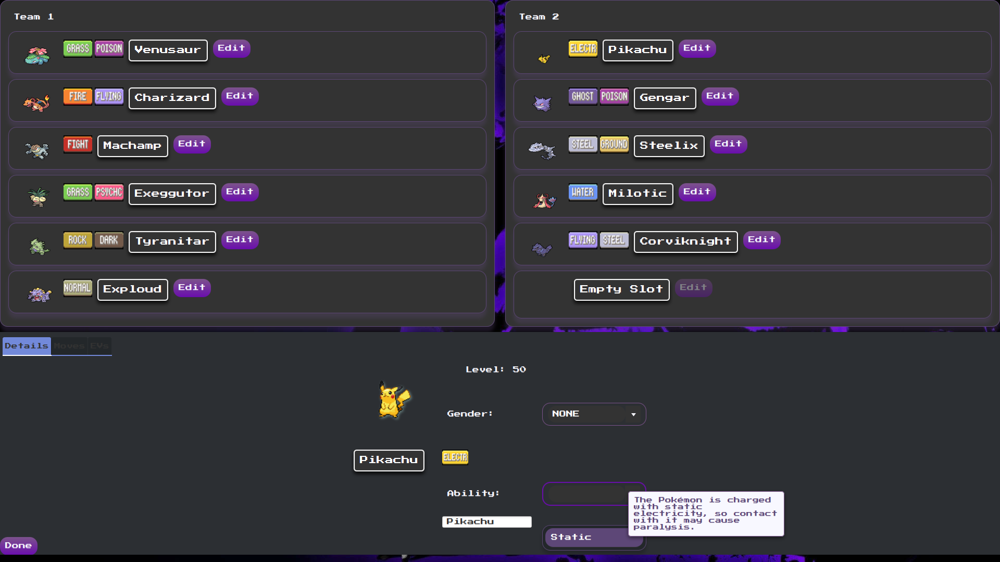
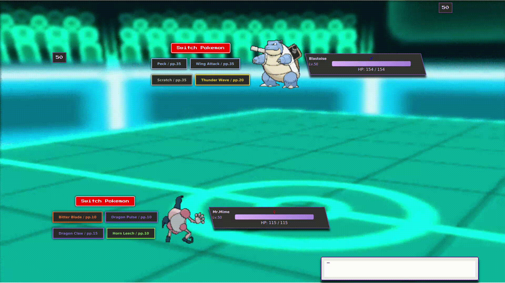

# Pokemon-Battle-Simulator

Pokémon Battle Simulator: A dynamic two-player game where players select their Pokémon teams and battle against each other. 
Built with JavaFX, this project offers an interactive gaming experience, emphasizing strategy and player choice. 
Currently, in development.

## Core Features

- **Team Selection:** Choose your team from a diverse roster of Pokémon, each with its unique abilities and moves.
- **Do It Yourself** Create each Pokémon individually, by choosing its ability, moves, EVs and more !
- **Battles:** Engage in exciting battles that unfold just like in the real game, offering a blend of strategy and fun.

## Preview

### Team-Selection

*This showcases the team selection page, where players can choose and customize their Pokémon team before heading into battle.*

### Battle

*This shows the battle in action, showing an encounter between two Pokémon, complete with strategic gameplay elements just like the real game.*

## Sprites

In this project, sprites are directly sourced from the [PokéAPI](https://pokeapi.co/).
The `PokeApiClient` class within the project is responsible for fetching data from the PokéAPI.

## Note
Please note that as the game is still in development, some features might not be fully implemented, and you may encounter bugs.

### Accessing the Game

Can only be played by cloning this repository. Once the development is complete, I will release a downloadable version of the game, 
making it easier for everyone to access and enjoy!

### Feedback & Suggestions

If you have any ideas on how to enhance the game or if you've encountered any issues while playing, please don't hesitate to share your thoughts. 
You can open an issue on this repository to discuss any feedback you might have.

---

**Current Pokémon-Amount: 97**

*This number is regularly updated!*

---
